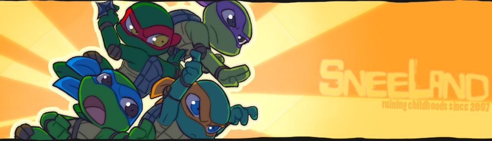
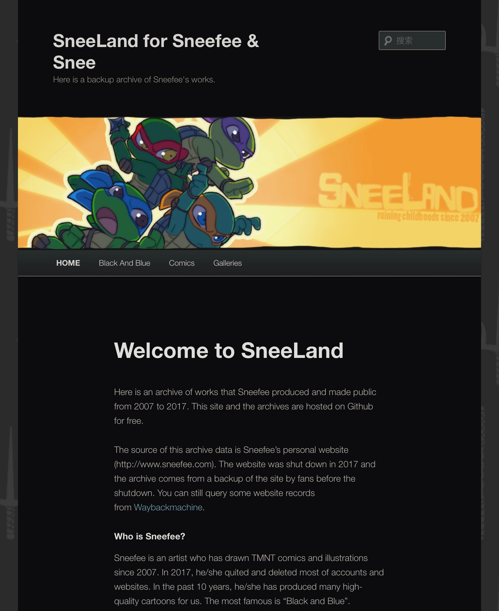
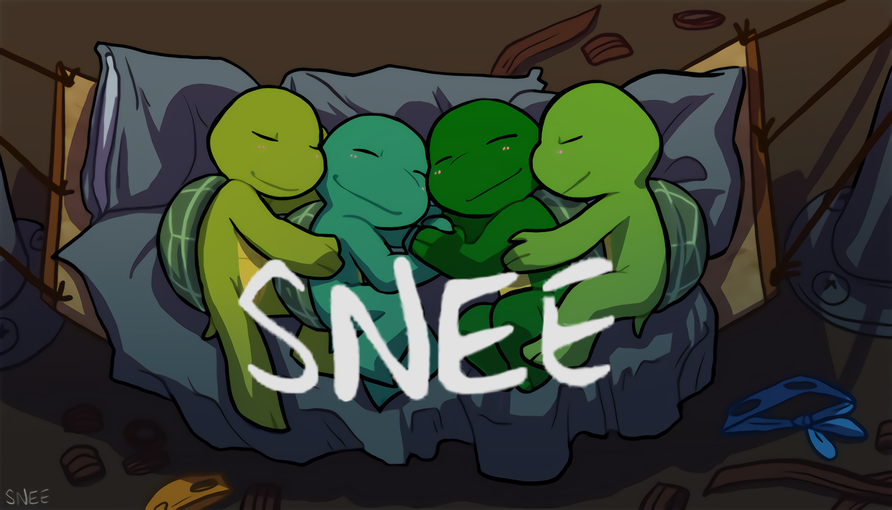
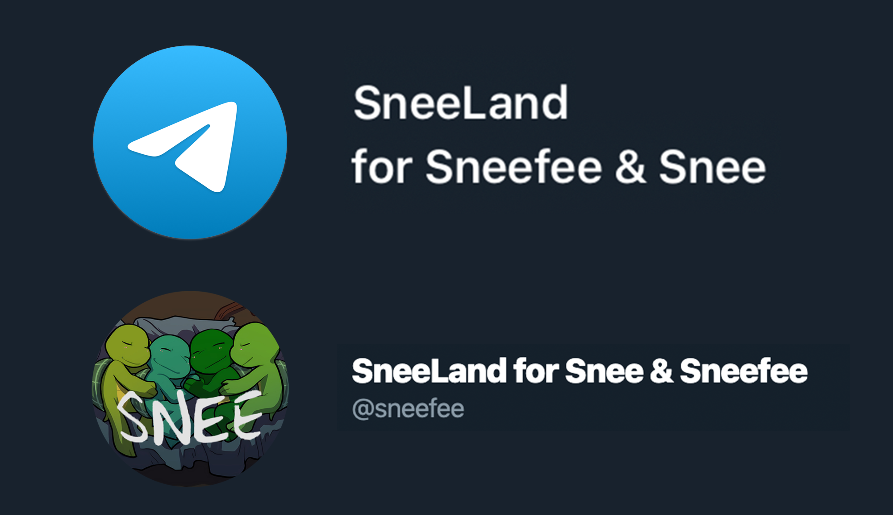

[English](./index.html)/[中文](./index_cn.html)

## A new site is under construction

Hi👋, we are updating the Sneeland(fan's backup version) website and mainly adding online reading function without download. Need several days. And the webside is more easier to share uncompressed images(We got many new archives😃).

By the way, the new website looks familiar...😉



## Welcome to SneeLand

Here is an archive of works that Sneefee produced and made public from 2007 to 2017. This site and the archives are hosted on Github for free.

The source of this archive data is Sneefee's personal website (`http://www.sneefee.com`). The website was shut down in 2017 and the archive comes from a backup of the site by fans before the shutdown. You can still query some website records from [Waybackmachine](http://web.archive.org/web/20160330125448/http://sneefee.com/).

## Who is Sneefee?

Sneefee is an artist who has drawn TMNT comics and illustrations since 2007. In 2017, he/she quited and deleted most of accounts and websites. In the past 10 years, he/she has produced many high-quality cartoons for us. The most famous is "Black and Blue".



## Archive directory

```markdown
- sneefee-sneeLand-fan.github.io
  |
  |-- _config.yml
  |-- index.md
  |-- index_cn.md
  |-- webimg
  |-- archive
    |
    |-- illustration
    |-- comic
      |
      |-- english
      |-- chinese
```

## Get Archive

You can directly click the "Download" button at the top of the webpage to get the entire project. After decompression, all archives are stored in the "archive" folder. Available in Chinese and English (Chinese version is translated free of charge by Chinese lovers).

If you only want to get a certain language version, please click [HERE](https://github.com/sneefee-sneeLand-fan/sneefee-sneeLand-fan.github.io) to download the corresponding compressed package.

## About

This project is initiated and established by enthusiasts, and all services are located on free hosting websites. Thanks to Github, Twitter, and Telegram for their free services. This project is a non-profit project without any expenditure.

### Other services

You can find the same archive on Twitter and Telegram. Due to Twitter privacy policy, NSFW content archives are not available on Twitter.

[Telegram](https://t.me/SneeLand_Sneefee)/[Twitter](https://twitter.com/sneefee)


## License

The copyright of all works in this project belongs to the author "Snee" & "Sneefee". No one is allowed to use any commercial purpose without his/her permission. This item is for fans' collection only.

Since Snee deleted his/her accounts and works in 2017, the project sponsor cannot contact him/her. If this project infringes anyone's rights, please contact by email `backblackto0#gmail.com`.
